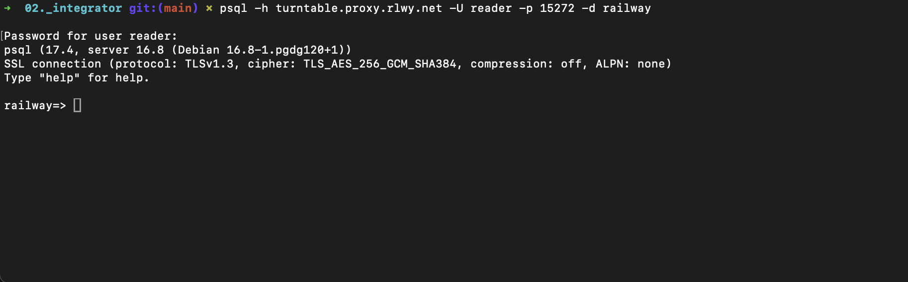
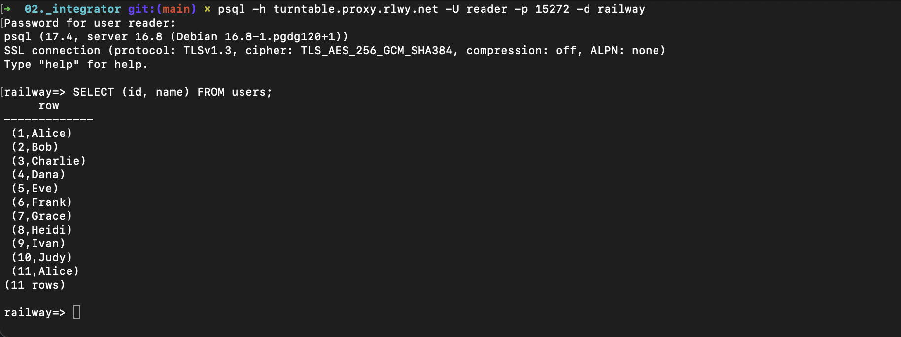
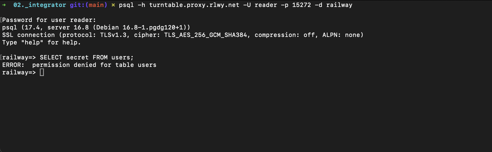
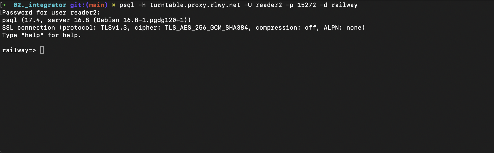
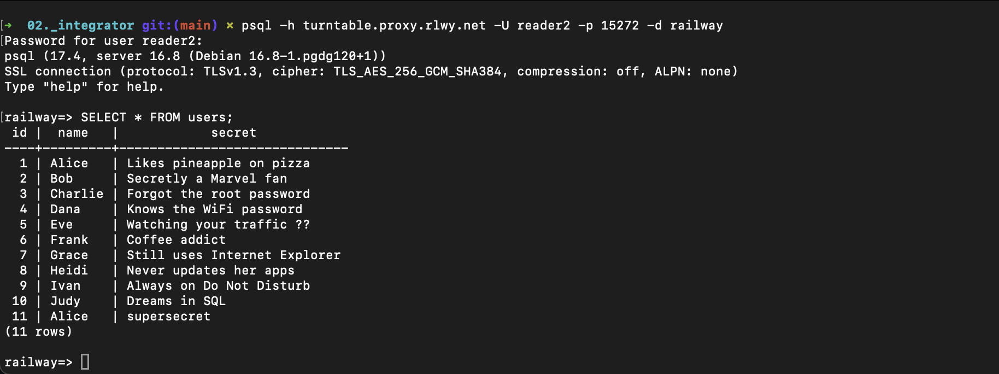
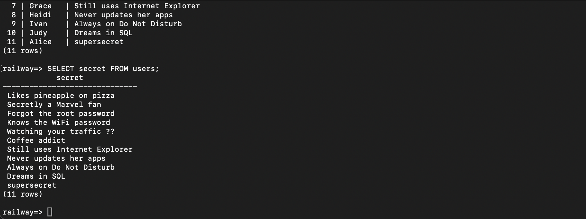
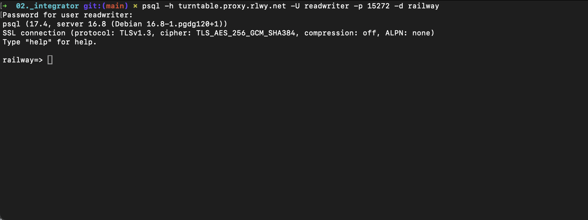
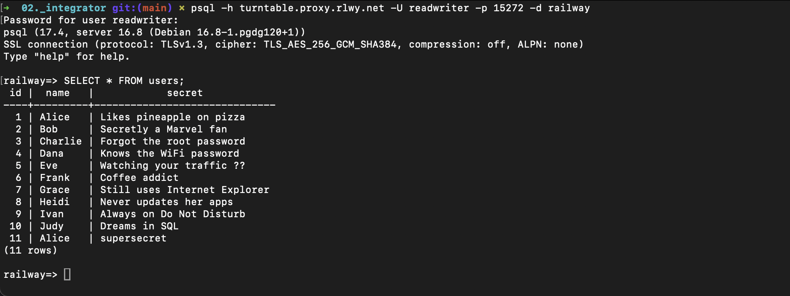
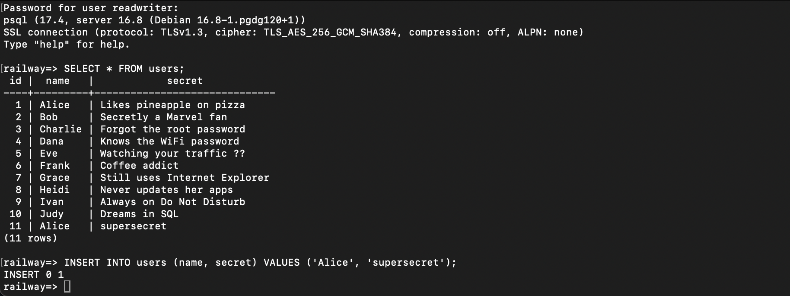
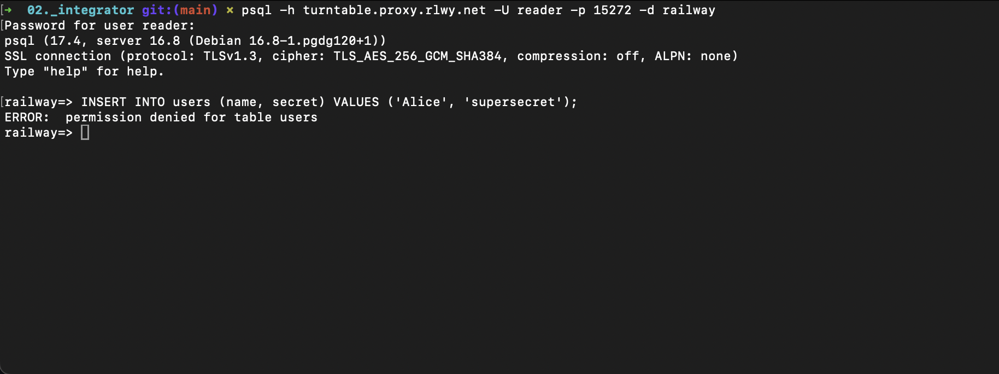

# PostgreSQL Integration Documentation - [@danieljappe](https://github.com/danieljappe/KEA_SystemIntegration/blob/main/00._Assignments/04._SSE/04b._granular-access/railway_granular_access.md)

## Role: Integrator

## Reader Role - Testing

### Connection Test

> Screenshot showing successful connection using reader credentials

### Data Access Tests

> Screenshot showing SELECT id, name FROM users with reader role (should only show id and name)

> Screenshot showing attempt to access secret column (should fail)

## Reader2 Role - Testing

### Connection Test

> Screenshot showing successful connection using reader2 credentials

### Data Access Tests

> Screenshot showing SELECT \* FROM users with reader2 role (should show all columns)

> Screenshot showing successful access to secret column

## ReadWriter Role - Testing

### Connection Test

> Screenshot showing successful connection using readwriter credentials

### Data Access Tests

> Screenshot showing SELECT \* FROM users with readwriter role

> Screenshot showing successful INSERT operation

## Verification of Access Control

### Unauthorized Access Attempts

> Screenshot showing failed write attempt with reader role trying to write a user

## Result

| Role       | Expected Access  | Actual Access    | Result |
| ---------- | ---------------- | ---------------- | ------ |
| Reader     | id, name only    | id, name only    | ✅     |
| Reader2    | All read access  | All read access  | ✅     |
| ReadWriter | Read all + write | Read all + write | ✅     |

## Feedback

- Good documentation
- Easy to connect
- Works as documented!
